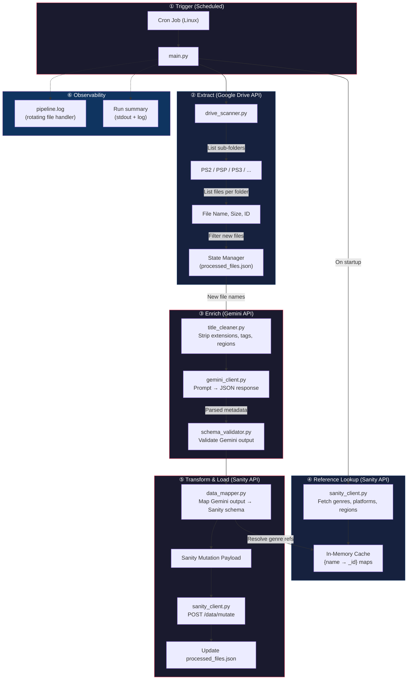
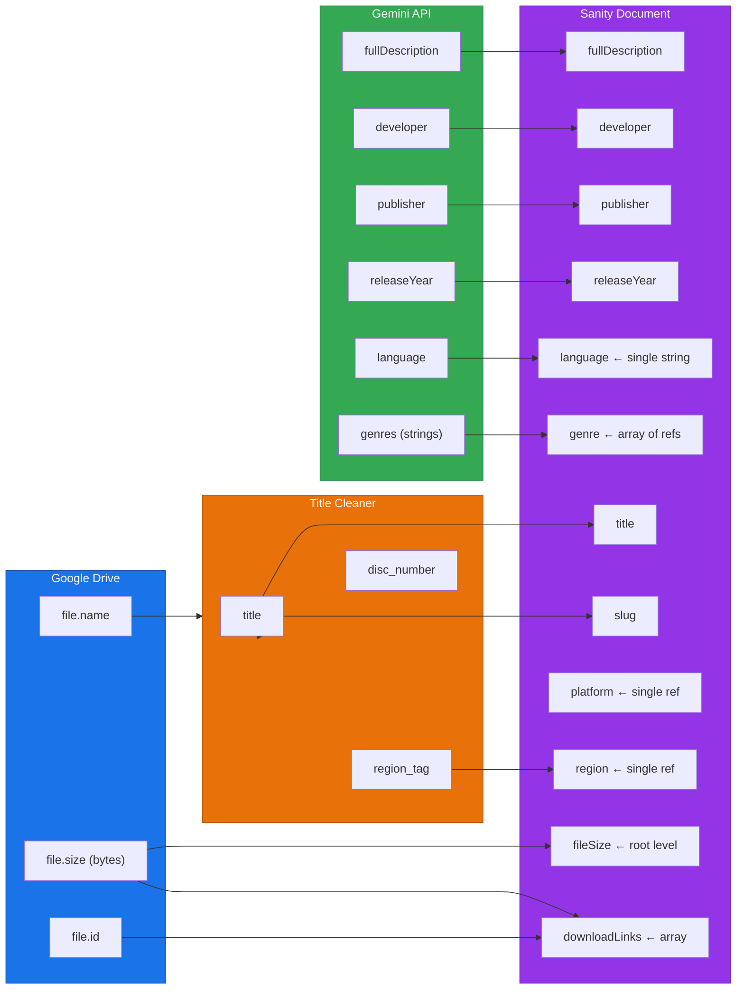
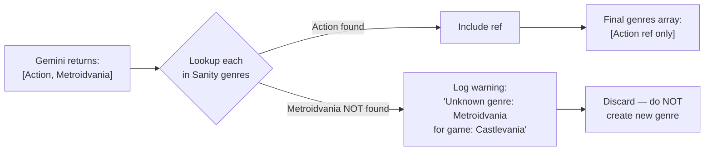

# Game Ingestion Pipeline — System Architecture & Implementation Plan

Automated pipeline: **Google Drive → Gemini AI → Sanity CMS**
Monitors Google Drive platform folders, enriches game metadata via Gemini, and pushes structured documents to Sanity.

---

## 1. High-Level Architecture



---

## 2. Execution Sequence (Step-by-Step)

### Phase 0 — Initialization
| Step | Action | Detail |
|------|--------|--------|
| 0.1 | Load environment | Read `.env` → `GOOGLE_CREDS_PATH`, `GEMINI_API_KEY`, `SANITY_PROJECT_ID`, `SANITY_DATASET`, `SANITY_TOKEN`, `DRIVE_PARENT_FOLDER_ID` |
| 0.2 | Authenticate Google Drive | OAuth 2.0 flow with `google-auth-oauthlib`. On first run opens browser for consent. Saves `token.json` for subsequent headless runs. Scopes: `drive.readonly` |
| 0.3 | Load processed state | Read `processed_files.json` → `Set[file_id]`. If file doesn't exist, create empty set (first run = process everything) |
| 0.4 | Fetch Sanity reference data | GROQ queries against Sanity to build three lookup dicts: `genres: {slug → _id}`, `platforms: {slug → _id}`, `regions: {slug → _id}` |

### Phase 1 — Google Drive Scan
| Step | Action | Detail |
|------|--------|--------|
| 1.1 | List sub-folders | `GET /drive/v3/files?q='<PARENT_ID>' in parents and mimeType='application/vnd.google-apps.folder'` → Returns `[{id, name}]` for each platform folder (PS2, PSP, etc.) |
| 1.2 | For each sub-folder | List all files: `GET /drive/v3/files?q='<FOLDER_ID>' in parents and mimeType!='application/vnd.google-apps.folder'&fields=files(id,name,size)` |
| 1.3 | Filter new files | Skip any `file.id` already in `processed_files.json` |
| 1.4 | Build raw records | For each new file, construct: `{file_id, file_name, file_size_bytes, platform_folder_name, download_url}` |
| 1.5 | Generate download URL | Format: `https://drive.google.com/uc?id={file_id}&export=download` (Direct Download) |

### Phase 2 — Title Cleaning & Region Extraction
| Step | Action | Detail |
|------|--------|--------|
| 2.1 | Strip file extension | Remove `.iso`, `.bin`, `.cso`, `.7z`, `.zip`, `.rar`, `.pkg`, `.pbp`, etc. |
| 2.2 | **Extract** region tag | Regex capture `(USA)`, `[Europe]`, `(J)`, `(En,Fr,De)`, etc. → store as `region_tag`. If no match → `region_tag = None` (will default to `"USA"` later) |
| 2.3 | Strip region/language tags | Remove the captured tags from the title string |
| 2.4 | Strip disc indicators | Capture `(Disc 1)`, `(Disk 2)`, `[CD1]` → store `disc_number`. Then remove from title |
| 2.5 | Normalize whitespace | Collapse multiple spaces, trim, title-case |
| 2.6 | Output | `{cleaned_title, region_tag, disc_number}` — e.g. `"Tekken 5 (USA) [PS2].iso"` → `{title: "Tekken 5", region: "USA", disc: None}` |

### Phase 3 — Gemini AI Enrichment
| Step | Action | Detail |
|------|--------|--------|
| 3.1 | Build prompt | Structured prompt with the cleaned title (see Section 5 below) |
| 3.2 | Call Gemini API | `POST /v1beta/models/gemini-2.0-flash:generateContent` with `response_mime_type: "application/json"` |
| 3.3 | Parse response | Extract JSON from Gemini response. If JSON parsing fails → log error, skip this game |
| 3.4 | Validate schema | Validate parsed JSON against expected schema (see Section 6). Missing/wrong-type fields → log, skip |
| 3.5 | Rate limit | Sleep `4 seconds` between calls (free tier: 15 RPM → ~4s/request is safe) |

### Phase 4 — Data Mapping & Reference Resolution
| Step | Action | Detail |
|------|--------|--------|
| 4.1 | Resolve genre refs | For each genre string from Gemini, slugify it and look up in `genres` dict. Unmatched genres → **log a warning and discard** (do NOT create new genres). Output key is `genre` (NOT `genres`) |
| 4.2 | Resolve platform | Map `platform_folder_name` → slugified key → look up in `platforms` dict → single `{"_type": "reference", "_ref": "..."}` |
| 4.3 | Resolve region | Use `region_tag` extracted from filename in Phase 2 → normalize (e.g., `"Europe"` → `"europe"`) → look up in `regions` dict. If `region_tag` is `None`, default to `"USA"` and log warning |
| 4.4 | Map language | Direct string from Gemini's `language` field → single string value (not a reference). Fallback: `"English"` |
| 4.5 | Generate `_id` | `slugify(f"{cleaned_title}-{platform_slug}")` → e.g. `"tekken-5-ps2"` |
| 4.6 | Generate `slug` | Same as `_id`, formatted as Sanity slug object: `{"_type": "slug", "current": "tekken-5-ps2"}` |
| 4.7 | Convert file size | Bytes → human-readable string: `< 1 GB` → `"XXX MB"`, `≥ 1 GB` → `"X.XX GB"` |
| 4.8 | Map root `fileSize` | Assign the converted size string to **root-level** `fileSize` field |
| 4.9 | Construct download link | `{"_key": "<unique>", "_type": "downloadLink", "sourceName": "Google Drive", "sourceType": "google-drive", "url": "https://drive.google.com/uc?id={file_id}&export=download", "fileSize": "<same_size_string>", "optionalLabel": "<disc_number>"}` |
| 4.10 | Build final payload | Full Sanity document object (see Section 7) |

### Phase 5 — Sanity Mutation
| Step | Action | Detail |
|------|--------|--------|
| 5.1 | POST mutation | `POST https://liftuy21.api.sanity.io/v2024-01-01/data/mutate/production` with `createIfNotExists` operation (idempotent — safe to re-run) |
| 5.2 | Handle response | `201` → success. `409` (conflict) → document exists, log & skip. `4xx/5xx` → log error, skip |
| 5.3 | Update state | Add `file_id` to `processed_files.json` only on successful mutation |

### Phase 6 — Finalization
| Step | Action | Detail |
|------|--------|--------|
| 6.1 | Save state file | Persist `processed_files.json` to disk |
| 6.2 | Print summary | `"Processed: X new games. Skipped: Y (errors). Total in state: Z."` |
| 6.3 | Flush logs | Ensure all log entries are written to `pipeline.log` |

---

## 3. Project File Structure

```
LBG - AI Agent/
├── .env                        # API keys, folder IDs, config
├── .env.example                # Template (committed to git)
├── .gitignore                  # Ignore .env, token.json, *.log, state/
├── requirements.txt            # Pinned dependencies
├── main.py                     # Entry point — orchestrates the pipeline
├── config.py                   # Loads .env, exposes typed config constants
│
├── clients/
│   ├── __init__.py
│   ├── drive_client.py         # Google Drive API wrapper
│   ├── gemini_client.py        # Gemini API wrapper with rate limiting
│   └── sanity_client.py        # Sanity GROQ queries + mutations
│
├── core/
│   ├── __init__.py
│   ├── title_cleaner.py        # Regex-based file name → game title
│   ├── data_mapper.py          # Maps raw data → Sanity document schema
│   ├── genre_resolver.py       # Gemini genres → Sanity genre refs
│   ├── schema_validator.py     # Validates Gemini JSON output shape
│   └── file_size_formatter.py  # Bytes → "XXX MB" / "X.XX GB"
│
├── state/
│   └── processed_files.json    # Persistent set of processed Drive file IDs
│
├── logs/
│   └── pipeline.log            # Rotating log file
│
└── credentials/
    ├── client_secret.json      # Google OAuth client credentials (git-ignored)
    └── token.json              # Auto-generated OAuth token (git-ignored)
```

---

## 4. Required Python Libraries

| Library | Purpose | Install |
|---------|---------|---------|
| `google-api-python-client` | Google Drive API v3 interaction | `pip install google-api-python-client` |
| `google-auth-oauthlib` | OAuth 2.0 consent flow for Google APIs | `pip install google-auth-oauthlib` |
| `google-auth-httplib2` | HTTP transport for Google auth | `pip install google-auth-httplib2` |
| `google-generativeai` | Official Gemini API Python SDK | `pip install google-generativeai` |
| `requests` | HTTP client for Sanity REST API | `pip install requests` |
| `python-dotenv` | Load `.env` file into `os.environ` | `pip install python-dotenv` |
| `python-slugify` | Reliable Unicode-safe slugification | `pip install python-slugify` |

> [!NOTE]
> No database, no web framework, no async libraries needed. This is deliberately kept as a simple synchronous script for reliability and debuggability.

---

## 5. Gemini Prompt Design

The prompt is engineered to return **structured JSON only**, with explicit constraints.

**Two key design decisions:**
1. The genre whitelist is **dynamically injected** from Sanity's actual genre titles at runtime — never hardcoded.
2. The `language` field is requested as a **single string** (e.g., `"English"`), matching the Sanity schema's single-value `language` field.

### 5.1 Prompt Template (Python f-string)

```
You are a video game metadata database. Given a game title and its platform,
return ONLY a valid JSON object with the following fields.
Do not include any explanation, markdown formatting, or code fences.

Required JSON schema:
{{
  "fullDescription": "string — A 2-3 paragraph description of the game covering gameplay, story, and critical reception.",
  "developer": "string — The primary developer studio name.",
  "publisher": "string — The primary publisher name.",
  "releaseYear": "number — The original release year as a 4-digit integer (e.g. 2005). If unknown, use null.",
  "language": "string — The primary language of this game version (e.g. 'English', 'Japanese', 'Multi-Language'). If unknown, default to 'English'.",
  "genres": ["string"] — An array of genre names. You MUST only use names from this exact list:
    [{genre_whitelist}].
    If the game's genre is not in this list, pick the closest match. Do NOT invent new genre names.
}}

Game title: "{cleaned_title}"
Platform: "{platform_name}"
```

### 5.2 Dynamic Genre Whitelist Injection

At runtime, `{genre_whitelist}` is replaced with a comma-separated list of genre titles fetched from Sanity at startup:

```python
# Example: genre_whitelist built from Sanity cache
genre_whitelist = ", ".join(sanity_genre_cache.keys())
# → "Action, Adventure, RPG, Fighting, Platformer, Shooter, ..."
```

This guarantees the prompt **always reflects the current Sanity dataset** — if you add a new genre in Sanity Studio, the next pipeline run automatically includes it in the prompt.

### 5.3 Expected Gemini JSON Response

```json
{
  "fullDescription": "Tekken 5 is a fighting game developed and published by Namco...",
  "developer": "Namco",
  "publisher": "Namco",
  "releaseYear": 2004,
  "language": "English",
  "genres": ["Fighting", "Action", "Arcade"]
}
```

### 5.4 Region Extraction — NOT from Gemini

> [!IMPORTANT]
> Region is **extracted from the original file name** by `title_cleaner.py` (Phase 2), NOT generated by Gemini. The title cleaner captures the region tag (e.g., `(USA)`, `[Europe]`, `(J)`) before stripping it from the title. If no region tag is found in the filename, the pipeline defaults to `"USA"` and logs a warning.

```
File: "Tekken 5 (USA).iso"  →  region_tag = "USA",    cleaned_title = "Tekken 5"
File: "Tekken 5 (Europe).iso" →  region_tag = "Europe", cleaned_title = "Tekken 5"
File: "Tekken 5.iso"          →  region_tag = None → default "USA", log warning
```

---

## 6. Schema Validation Strategy

### 6.1 Gemini Output Validation

After parsing the JSON from Gemini, validate:

| Field | Type Check | Constraint | On Failure |
|-------|-----------|------------|------------|
| `fullDescription` | `str` | Non-empty, max 5000 chars | Use fallback: `"No description available."` |
| `developer` | `str` | Non-empty | Use fallback: `"Unknown"` |
| `publisher` | `str` | Non-empty | Use fallback: `"Unknown"` |
| `releaseYear` | `int` or `None` | If int: `1970 ≤ year ≤ current_year + 1` | Set to `None` |
| `language` | `str` | Non-empty | Use fallback: `"English"` |
| `genres` | `list[str]` | Non-empty list | Use fallback: `["Action"]` (most common safe default) |

### 6.2 Sanity Payload Validation

Before sending the mutation, validate:

| Check | Rule | On Failure |
|-------|------|------------|
| `_id` exists | Non-empty string | Fatal — skip game |
| `platform` ref resolved | `_ref` is a valid Sanity ID | Fatal — skip game |
| `region` ref resolved | `_ref` is a valid Sanity ID | Fatal — skip game |
| `language` exists | Non-empty string | Warning — use `"English"` default |
| `fileSize` exists (root) | Non-empty string | Fatal — skip game |
| At least 1 genre resolved | At least one Gemini genre matched a Sanity genre | Warning — proceed with empty genre array |
| `downloadLinks` has entry | Array is non-empty with valid URL | Fatal — skip game |

---

## 7. API Data Mapping — Sanity Document Schema

### 7.1 Corrected Sanity `game` Document Shape

```json
{
  "_type": "game",
  "_id": "tekken-5-ps2",
  "title": "Tekken 5",
  "slug": {
    "_type": "slug",
    "current": "tekken-5-ps2"
  },
  "fullDescription": [
    {
      "_type": "block",
      "children": [
        {
          "_type": "span",
          "text": "Tekken 5 is a fighting game developed and published by Namco. It was released in 2004..."
        }
      ]
    }
  ],
  "developer": "Namco",
  "publisher": "Namco",
  "releaseYear": 2004,
  "language": "English",
  "popularityScore": 0,
  "fileSize": "1.24 GB",
  "thumbnail": null,
  "screenshots": [],
  "platform": {
    "_type": "reference",
    "_ref": "platform-ps2-id"
  },
  "region": {
    "_type": "reference",
    "_ref": "region-usa-id"
  },
  "genre": [
    {
      "_type": "reference",
      "_ref": "genre-fighting-id",
      "_key": "a1b2c3d4"
    },
    {
      "_type": "reference",
      "_ref": "genre-action-id",
      "_key": "e5f6g7h8"
    },
    {
      "_type": "reference",
      "_ref": "genre-arcade-id",
      "_key": "i9j0k1l2"
    }
  ],
  "downloadLinks": [
    {
      "_type": "downloadLink",
      "_key": "dl-gdrive-001",
      "sourceName": "Google Drive",
      "sourceType": "google-drive",
      "url": "https://drive.google.com/uc?id=FILE_ID&export=download",
      "fileSize": "1.24 GB",
      "optionalLabel": "Disc 1"
    }
  ]
}
```

> [!IMPORTANT]
> **Corrections:**
> 1. `genre` (NOT `genres`) — array of references
> 2. `language` — single string field
> 3. `fileSize` — root-level string (in addition to the one inside `downloadLinks`)
> 4. `region` — resolved from filename tag
> 5. `platform` — confirmed single reference object

### 7.2 Field Source Mapping

| Sanity Field | Source | Transform |
|-------------|--------|-----------|
| `_type` | Hardcoded | `"game"` |
| `_id` | File name + folder | `slugify(cleaned_title + "-" + platform_slug)` → e.g. `"tekken-5-ps2"` |
| `title` | File name | `title_cleaner(file_name)` → cleaned, no extension/tags |
| `slug.current` | Derived | Same value as `_id` |
| `fullDescription` | Gemini API | Gemini returns plain string → `data_mapper.py` wraps into **Portable Text blocks**: `[{"_type": "block", "children": [{"_type": "span", "text": "<paragraph>"}]}]`. Split on `\n\n` for multi-paragraph. |
| `developer` | Gemini API | Direct string, fallback `"Unknown"` |
| `publisher` | Gemini API | Direct string, fallback `"Unknown"` |
| `releaseYear` | Gemini API | Integer or `null` |
| `language` | Gemini API | **Single string** (e.g. `"English"`), fallback `"English"` |
| `popularityScore` | Hardcoded | `0` |
| `fileSize` | Google Drive `file.size` | Bytes → `"XXX MB"` or `"X.XX GB"` string — **root level** |
| `thumbnail` | Hardcoded | `null` (manual later) |
| `screenshots` | Hardcoded | `[]` (manual later) |
| `platform` | Folder name → Sanity lookup | **Single reference**: `{"_type": "reference", "_ref": platforms[slug]}` |
| `region` | **Filename tag** → Sanity lookup | **Single reference**: `{"_type": "reference", "_ref": regions[slug]}`. Extracted from `(USA)`, `[Europe]` etc. in the original filename. Default: `"USA"` if no tag found. |
| `genre` | Gemini → slugify → Sanity lookup | **Array of references**: `[{"_type": "reference", "_ref": genres[slug], "_key": uuid4()}, ...]`. Key name is `genre`, NOT `genres`. |
| `downloadLinks` | Google Drive file ID + size + disc number | Array: `[{"_type": "downloadLink", "_key": uuid4(), "sourceName": "Google Drive", "sourceType": "google-drive", "url": "https://drive.google.com/uc?id={file_id}&export=download", "fileSize": "<same_size_string>", "optionalLabel": "<disc_number_from_Phase_2>"}]` |

### 7.3 Data Flow Diagram — Field Origins



---

## 8. GROQ Queries for Reference Data

```groq
// Fetch all genres
*[_type == "genre"]{ _id, "slug": slug.current, title }

// Fetch all platforms
*[_type == "platform"]{ _id, "slug": slug.current, title }

// Fetch all regions
*[_type == "region"]{ _id, "slug": slug.current, title }
```

These are fetched once at startup and cached in memory as `dict[slug, _id]`.

---

## 9. Edge Case Handling

### 9.1 Gemini Hallucinates a Non-Existent Genre



**Mitigation**: The Gemini prompt already constrains genres to a whitelist. The whitelist is dynamically generated from Sanity's actual genres at runtime, so it stays in sync. Any genre that still slips through is silently discarded with a log warning.

### 9.2 Duplicate Game Title Across Platforms

Two folders (PS2, PSP) both contain `"Tekken 5.iso"`. The slug `tekken-5` would collide.

**Solution**: Append platform suffix to `_id`: `"tekken-5-ps2"` vs `"tekken-5-psp"`. The `_id` and `slug` will be `slugify(f"{cleaned_title}-{platform_slug}")`.

### 9.3 Gemini Returns Invalid/Unparseable JSON

- **First defense**: Use `response_mime_type: "application/json"` in the Gemini API call to enforce JSON output mode.
- **Second defense**: Wrap `json.loads()` in try/except. On failure, log raw response text for debugging, skip the game.

### 9.4 Gemini Returns `null` or Empty for Critical Fields

Apply fallback defaults (see Section 6.1). The pipeline is resilient — only `_id`, `platform`, `region`, and `downloadLinks` are fatal if missing.

### 9.5 Google Drive API Pagination

If a platform folder has > 100 files (default page size), the Drive API returns a `nextPageToken`. The scanner must loop until `nextPageToken` is `None`.

### 9.6 Network Failures / Transient Errors

- Google Drive / Sanity: `requests` will raise exceptions on timeouts. Catch, log, skip the game.
- Gemini SDK: Wrap in try/except for `google.api_core.exceptions`. Log and skip.
- State file is saved atomically (write to temp file, then rename) to prevent corruption on crash.

### 9.7 Multi-Disc Games

Files like `"Final Fantasy VII (Disc 1).iso"` and `"Final Fantasy VII (Disc 2).iso"`:
- Both get cleaned to `"Final Fantasy VII"`.
- Both would produce the same `_id`, causing a collision.

**Solution**: Detect disc indicators during title cleaning. Append the disc number to the download link entry but use the **same game document `_id`**. On the second file, use Sanity `patch` mutation to append to the existing `downloadLinks` array instead of `createIfNotExists`.

### 9.8 Empty Platform Folder

If a scanned folder contains 0 new files, log `"No new files in PS2 folder"` and continue to next folder. Not an error.

### 9.9 Slug Collision with Different Games

Edge case: two genuinely different games produce the same slug (e.g., re-releases). The `createIfNotExists` mutation is safe — it won't overwrite. A warning log will note `"Document already exists: <_id>"`.

---

## 10. `.env` Configuration Template

```env
# Google Drive
GOOGLE_CREDS_PATH=credentials/client_secret.json
DRIVE_PARENT_FOLDER_ID=your_parent_folder_id_here

# Gemini
GEMINI_API_KEY=your_gemini_api_key_here
GEMINI_MODEL=gemini-2.0-flash

# Sanity
SANITY_PROJECT_ID=liftuy21
SANITY_DATASET=production
SANITY_TOKEN=your_sanity_write_token_here
SANITY_API_VERSION=2024-01-01

# Rate Limiting
GEMINI_DELAY_SECONDS=4
```

---

## 11. Sanity Mutation Strategy

Using `createIfNotExists` for idempotent inserts:

```json
{
  "mutations": [
    {
      "createIfNotExists": {
        "_type": "game",
        "_id": "tekken-5-ps2",
        "title": "Tekken 5",
        "...": "..."
      }
    }
  ]
}
```

For **multi-disc games** (appending download links to an existing document):

```json
{
  "mutations": [
    {
      "patch": {
        "id": "final-fantasy-vii-ps2",
        "insert": {
          "after": "downloadLinks[-1]",
          "items": [
            {
              "_type": "downloadLink",
              "_key": "disc-2-key",
              "sourceName": "Google Drive",
              "sourceType": "google-drive",
              "url": "https://drive.google.com/uc?id=DISC2_ID&export=download",
              "fileSize": "650 MB",
              "optionalLabel": "Disc 2"
            }
          ]
        }
      }
    }
  ]
}
```

---

## 12. Logging Strategy

- **Library**: Python's built-in `logging` module with `RotatingFileHandler` (5 MB max, 3 backups)
- **Levels**: `INFO` for normal flow, `WARNING` for skipped genres/fallbacks, `ERROR` for skipped games
- **Format**: `[2026-09-01 09:30:00] [INFO] [drive_scanner] Scanning folder: PS2 (ID: abc123)`
- **Console**: Also streams to stdout for real-time monitoring
